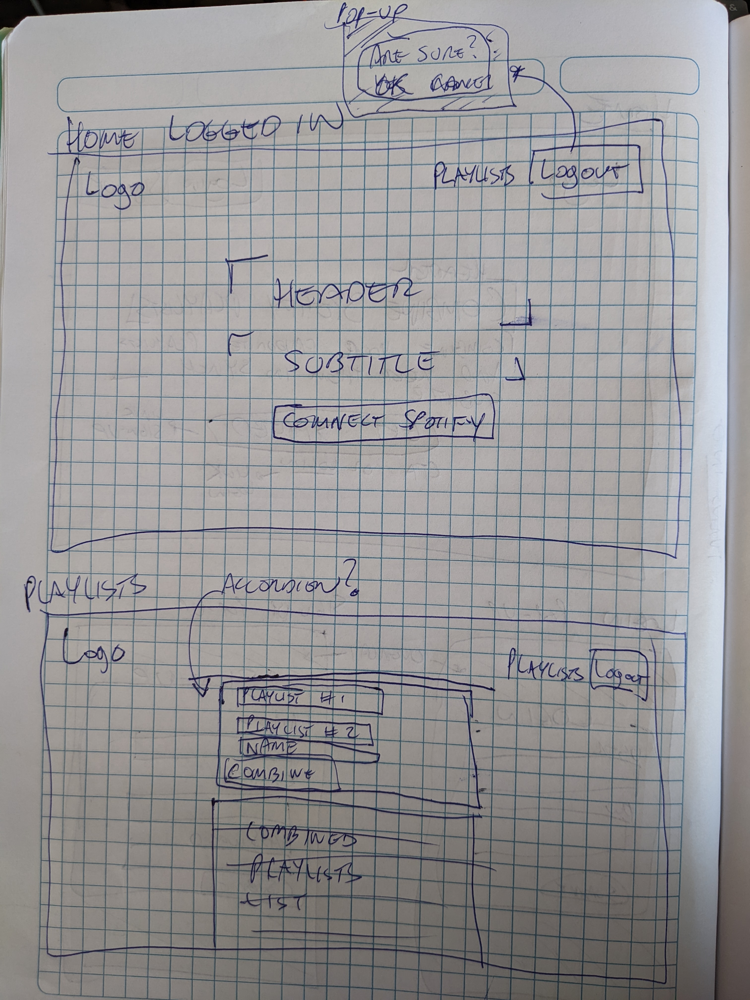
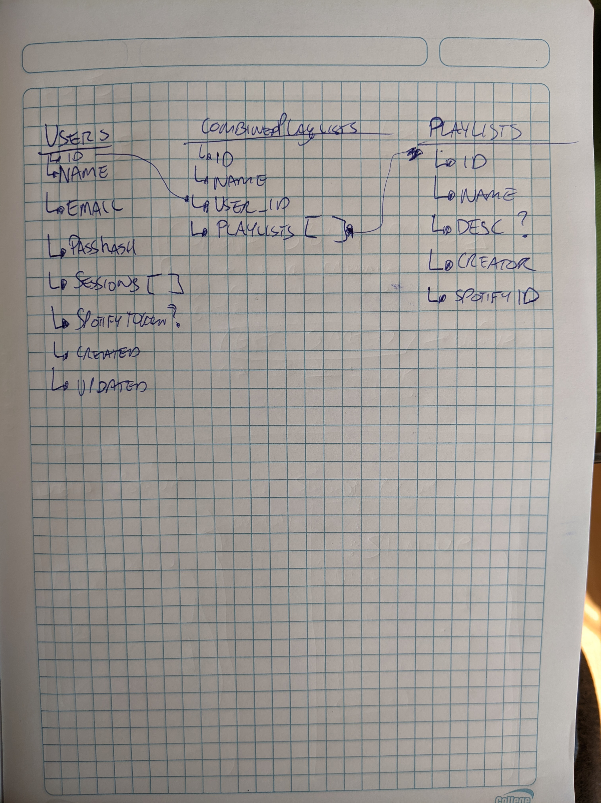

# SpotList | Spotify Playlist Combiner

## Description

Have you ever wanted to be able to add songs to customize a public playlist in Spotify? Of course you can just clone a public playlist, but what happens if they update it? Are you going to check those playlists every day just to make sure your playlists are in synch? Well, fret no more because the solution is here: SpotList - your friendly Spotify Playlist Combiner with automatic synch.

[Live link to SpotList](https://spotlist.prb01.com)

## Final Deliverable (v1)

App where user creates account and links their Spotify account. Then, adds playlists they want to combine. App will use Spotify API to create a new playlist which is a combination of the 2 playlists. The synching of the playlists will be done manually in v1 with the idea that it becomes a daily/hourly task performed server-side in v2.

## Sprint Progress

### Sprint 1

- [x] Get app approved (DM Scott for approval)
- [x] Create mockups (physical paper, low-fi)
- [x] Define scope (DM Scott for approval)
  - [x] Define milestones for each sprint
  - [x] Define final deliverable for v1
- [x] App must
  - [x] Be publicly accessible
  - [x] Have working authentication
  - [x] Have technical component 5% done
- [x] Spotify Authentication

### Sprint 2

- [x] Technical component 25%
- [x] Re-evaluate milestones and features
- [x] Setup database, Design & Create collections
- [x] Create reducer to add playlists to database

### Sprint 3

- [x] Technical component 50%
- [x] Re-evaluate milestones and features
- [x] Create functions to perform necessary Spotify actions with API (CRUD)

### Sprint 4

- [x] Technical component 100%
- [x] Combine playlist on creation
- [x] Show combined playlists
- [x] Ability to delete combined playlist
- [x] Layout & Styling

## Mockups

|  |  |
|----------------------------------------------------------------------|----------------------------------------------------------------------|
|  |
